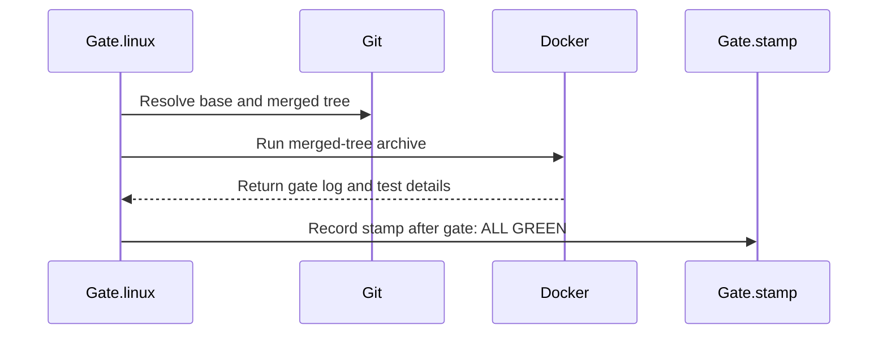

<!-- This is an auto-generated comment: summarize by coderabbit.ai -->
<!-- review_stack_entry_start -->

Navigate logical layers of code changes, visualize relationships, and explore their blast radius.

<!-- review_stack_entry_end -->
<!-- recent_review_start -->

No actionable comments were generated in the recent review. 🎉

ℹ️ Recent review info

⚙️ Run configuration

- **Configuration used**: Organization UI
- **Review profile**: CHILL
- **Plan**: Advanced
- **Run ID**: `redacted`

📥 Commits

Reviewing files that changed from the base of the PR and between 09b7cb1921ad7d4a84eb930c3741ab3a894b417c and a4fdac2456cb99a43f86a6a4efe15a6ce41879f1.

📒 Files selected for processing (1)

* `Makefile`

**Included review availability:** This review used your included allowance. Your plan provides up to 8 included reviews per hour; 6 remain after this review.

---

<!-- recent_review_end -->
<!-- walkthrough_start -->

📝 Walkthrough

## Walkthrough

The changes add a Linux-container test gate, record and verify tested-tree commit trailers, and check staged C and Ruby test changes through Git hooks. The Makefile adds hook setup, and the contributor guide documents the workflow.

### Changes

**Gate workflow**

|Layer / File(s)|Summary|
|:---|:---|
|**Test stamps and commit trailers**   `tools/gate.rb`, `tools/hooks/commit-msg`|The gate records a stamp when the current tree matches the tree recorded at gate start. The commit-message hook adds a `Gate:` trailer when the stamped tree matches the probe merge tree. Verification reports distinct statuses for missing commits, absent trailers, unknown bases, and tested-tree mismatches.|
|**Staged-change validation**   `tools/gate.rb`, `tools/hooks/pre-commit`|The pre-commit hook runs checks for staged C function sizes and new Ruby tests. The checks include fixed `/tmp` paths, missing expected files, unstaged inputs, CRuby timeouts, and output mismatches.|
|**Linux gate execution**   `tools/gate.rb`, `tools/gate/Dockerfile`, `Makefile`|The Linux runner validates the merged tree, runs it in Docker, and records a stamp after the log reports `gate: ALL GREEN`. The `gate` target runs start and stamp commands around its build and test steps.|
|**Hook setup and contributor instructions**   `Makefile`, `CONTRIBUTING.md`|The Makefile adds a `hooks` target to configure `tools/hooks`. The contributor guide documents hook setup, gate trailers, verification, and Linux execution.|

<!-- change_assessment_start -->
**Priority:** ⬇️ Low

**Estimated code review effort:** 3 (Moderate) | ~25 minutes

<!-- change_assessment_commit:"a4fdac2456cb99a43f86a6a4efe15a6ce41879f1" -->
**Change:** Feature
<!-- change_assessment_end -->

### Sequence Diagram(s)

**Suggested reviewers:** `matz`

<!-- walkthrough_end -->
<!-- final_review_risk_start -->
**Merge Risk:** _🔵 Low_ · up to `a4fda`
<!-- final_review_risk_coverage:{"sourceCommitId":"a4fdac2456cb99a43f86a6a4efe15a6ce41879f1","coveredCommitId":"a4fdac2456cb99a43f86a6a4efe15a6ce41879f1","kind":"reviewed"} -->

The hook documentation should be corrected to match its narrower actual coverage; the implementation risks identified in the gate lifecycle are otherwise resolved.
<!-- final_review_risk_end -->
<!-- architecture_review_start -->
### Security Architecture Review

**Security architecture risk:** _🟡 Moderate_ · up to `a4fda`

The new workflow can associate test results with the wrong execution when native runs overlap or stale state is reused. Its shared container cache can also carry executable inputs from an earlier run into later runs. These risks affect the reliability of gate evidence and isolation between developer test runs; no production deployment change or host escape is demonstrated.

**Retained concerns**
- **Medium · reliability · inferred:** The native attestation transition is not owned by an individual execution. A second start can overwrite the shared gate-start marker; after the worktree changes to that second tree, the first run can consume the replacement marker and stamp results that did not test that tree. An interrupted run also leaves a marker that the standalone stamp command can consume without proof of successful completion. Trailer matching cannot detect this misassociation because it validates tree identity rather than execution ownership.
- **Medium · security · inferred:** The new fixed-name Docker cache transfers mutable executable dependencies across runs without binding them to repository identity, dependency content, or successful completion. A branch run can populate an initially missing cached Optcarrot directory with modified Ruby code, fail, and still have that directory copied into the persistent volume. A later trusted-tree run restores it and executes its pack-for-spinel.rb script because the existing-directory check skips cloning. This permits code and test-input contamination across runs sharing the volume; no host escape is established.

Security review details

**Security Blast Radius**
- _inferred_ — Demonstrated scope is local Git metadata, configured developer hooks, and containers sharing the spinel-gate-cache volume on the selected Docker daemon. The fixed volume name does not separate repository or branch trust domains. Downstream production acceptance of Gate trailers is not established.

**Security Findings and Attack Paths**
- _inferred_ — An attacker who induces execution of a modified branch in the Linux gate can prepare cached executable test material. Even a failed run can persist a previously absent cache directory; a subsequent trusted-tree run restores and executes it. This expands influence beyond the original container invocation, although execution remains inside the later container and no credential theft or host compromise is demonstrated.

**Trust Boundaries and Controls**
- _observed_ — Explicit hook activation controls entry into developer commit policy. Archive input and switching build/test execution to the gate user bound container authority. Exact tree comparison controls trailer attachment, but neither that comparison nor the verifier establishes who executed the gate or the provenance of cached dependencies.

**Resilience and Maintainability Implications**
- _inferred_ — The new persistent marker and cache states need recovery semantics independent of process success. Consuming an unowned native marker or retaining failed-run dependency content can undermine later gate evidence even when the later commit's tree matches its trailer.

**Hardening Proposals**
- _proposed_ — Bind native start, successful completion, and stamp publication to one run identity; serialize or isolate executions, publish state atomically, and invalidate incomplete markers on failure or interruption.
- _proposed_ — Separate caches by repository and trust domain, validate dependency content against expected versions or digests, and avoid publishing mutable executable content from failed or untrusted runs into caches consumed by trusted runs.
- _proposed_ — Treat Gate trailers as local tree-correspondence metadata. If they become a security-sensitive merge requirement, authenticate execution provenance through a trusted runner rather than relying on contributor-controlled trailer text.

<!-- architecture_review_end -->
<!-- pre_merge_checks_walkthrough_start -->

🚥 Pre-merge checks | ✅ 4 | ❌ 1

### ❌ Failed checks (1 warning)

|     Check name     | Status     | Explanation                                                                                                                                                                                               | Resolution                                                                         |
| :----------------: | :--------- | :-------------------------------------------------------------------------------------------------------------------------------------------------------------------------------------------------------- | :--------------------------------------------------------------------------------- |
| Docstring Coverage | ⚠️ Warning | Docstring coverage is 0.00% which is insufficient. The required threshold is 80.00%. Docstring coverage is scoped to functions touched by this diff. Analyzed 18 functions across 1 files. (1 skipped: 1… | Write docstrings for the functions missing them to satisfy the coverage threshold. |

✅ Passed checks (4 passed)

|         Check name         | Status   | Explanation                                                                                                                      |
| :------------------------: | :------- | :------------------------------------------------------------------------------------------------------------------------------- |
|      Description Check     | ✅ Passed | Check skipped - CodeRabbit’s high-level summary is enabled.                                                                      |
|         Title check        | ✅ Passed | The title clearly states the main change: `make gate` records the tested tree, and `tools/gate.rb` adds it to a `Gate:` trailer. |
|     Linked Issues check    | ✅ Passed | Check skipped because no linked issues were found for this pull request.                                                         |
| Out of Scope Changes check | ✅ Passed | Check skipped because no linked issues were found for this pull request.                                                         |

Full details: Docstring Coverage

**Explanation**

Docstring coverage is 0.00% which is insufficient. The required threshold is 80.00%. Docstring coverage is scoped to functions touched by this diff. Analyzed 18 functions across 1 files. (1 skipped: 1 unsupported.)

<!-- pre_merge_checks_walkthrough_end -->

- [ ] <!-- {"checkboxId":"585bb3f6-faf5-4dbf-96d2-74e382adf19a"} --> Fix all pre-merge checks with AI
<!-- autopilot:start -->
- [ ] <!-- {"checkboxId":"2708ad07-9f24-4260-9c11-7dc76a49f2e3"} --> <strong title="Keep fixing CodeRabbit findings and required CI, and resolving merge conflicts">Autopilot</strong> · Keep fixing CodeRabbit findings and required CI, and resolving merge conflicts
<!-- autopilot:end -->
<!-- tips_start -->

---

Thanks for using [CodeRabbit](https://coderabbit.ai?utm_source=oss&utm_medium=github&utm_campaign=matz/spinel&utm_content=7289)! It's free for OSS, and your support helps us grow. If you like it, consider giving us a shout-out.

❤️ Share

- [X](https://example.com)
- [Mastodon](https://example.com)
- [Reddit](https://example.com)
- [LinkedIn](https://example.com)

Comment `@coderabbitai help` to get the list of available commands.

<!-- tips_end -->